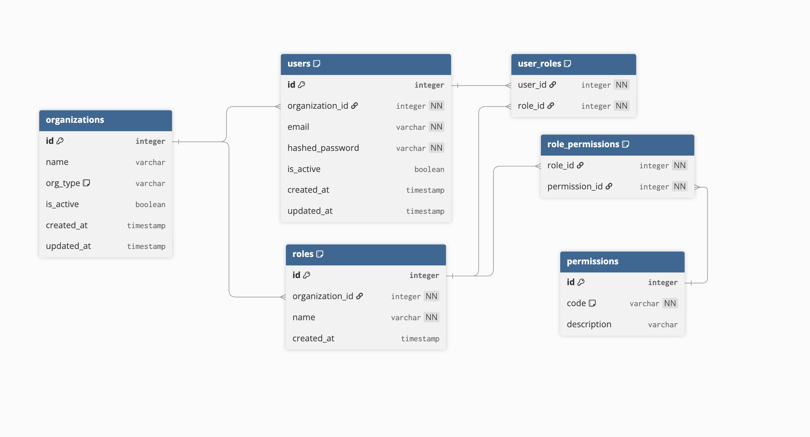

# Backend Architecture — Legal Tech ERP (MVP)
FastAPI-based backend for the Legal Tech SaaS platform supporting multi-tenant law firms and solo lawyers.
## 1. Purpose

This backend powers a **multi-tenant legal ERP system** for:

* Law firms
* Solo lawyers

It ensures:

* Data isolation between firms
* Secure authentication
* Role-based access control (RBAC)

---

## 2. Core Principles

* **Multi-tenant by design**
* **Security first**
* **Simple, scalable MVP**
* **No direct permission assignment to users**

---

## 3. Tech Stack (MVP)

* **Backend Framework:** FastAPI
* **Database:** PostgreSQL
* **ORM:** SQLAlchemy
* **Auth:** JWT (Access + Refresh tokens)
* **RBAC:** Role → Permission model
* **Migrations:** Alembic
* **ASGI Server:** Uvicorn
* **Language:** Python 3.11+
* **Validation:** Pydantic 2.0
* **Environment Management:** python-dotenv

---

## 4. Multi-Tenancy Model

* Each law firm or solo lawyer is an **Organization**
* Every user belongs to **exactly one organization**
* All queries are scoped by `organization_id`

This prevents cross-firm data access.

---

## 5. Authentication Flow

1. User logs in with email + password
2. Credentials are verified
3. JWT token is issued
4. Token contains:

   * `user_id`
   * `organization_id`

Tokens identify **who** the user is and **which firm** they belong to.

---

## 6. Authorization (RBAC)

### Entities

* Users
* Roles (organization-scoped)
* Permissions (global)

### Rule

```
User → Role → Permissions
```

Users **never** receive permissions directly.

---

## 7. Permission Checking

* Each API route declares required permission(s)
* On request:

  1. User is identified via JWT
  2. User roles are loaded
  3. Role permissions are resolved
  4. Access is allowed or denied

Only `permission.code` is used for checks.

---

## 8. Database Design (Core Tables)

* organizations
* users
* roles
* permissions
* user_roles
* role_permissions




This supports secure multi-tenancy and flexible RBAC.

---

## 9. Project Structure

```
legal-tech-backend/
├── app/
│   ├── __init__.py
│   ├── main.py                    # FastAPI application entry point
│   ├── core/
│   │   ├── __init__.py
│   │   └── config.py              # Application configuration
│   └── api/
│       ├── __init__.py
│       └── v1/
│           ├── __init__.py
│           └── api_router.py      # API v1 routes
├── .env.example                    # Environment variables template
├── .gitignore                      # Git ignore rules
├── requirements.txt                # Python dependencies
├── run.py                          # Application runner
└── README.MD                       # Project documentation
```

## 10. Quick Start

### Prerequisites

- Python 3.11 or higher
- pip (Python package manager)

### Installation

1. Clone the repository and navigate to the backend directory:
```bash
cd legal-tech-backend
```

2. Create a virtual environment:
```bash
python -m venv venv
```

3. Activate the virtual environment:

On macOS/Linux:
```bash
source venv/bin/activate
```

On Windows:
```bash
venv\Scripts\activate
```

4. Install dependencies:
```bash
pip install -r requirements.txt
```

5. Create environment file:
```bash
cp .env.example .env
```

### Running the Application

#### Option 1: Using the run script
```bash
python run.py
```

#### Option 2: Using uvicorn directly
```bash
uvicorn app.main:app --reload --host 0.0.0.0 --port 8000
```

The API will be available at:
- API Base: `http://localhost:8000`
- Interactive API Docs: `http://localhost:8000/docs`
- Alternative Docs: `http://localhost:8000/redoc`

## 11. Available Endpoints

### Root
- **GET /** - Welcome message and API information

### Health Check
- **GET /api/v1/health** - API health status check
---

## 12. Development

### Project Status
This is the initial setup with basic FastAPI structure and health check endpoint.

### Upcoming Features
- Database integration (PostgreSQL with SQLAlchemy 2.0)
- Authentication (JWT + OAuth2)
- Role-based access control (RBAC)
- Multi-tenancy support
- User management
- Organization management
- Case management
- Hearing and calendar management
- Document management
- Audit logging
- Background tasks (Celery/Redis)

## 13. API Versioning

The API uses URL-based versioning with the prefix `/api/v1/` for version 1 endpoints.

## 14. CORS Configuration

CORS is currently configured to allow all origins for development. This should be restricted in production.

---

## 15. Security Rules

* All endpoints require authentication (except login)
* Organization data is always scoped
* Inactive users and organizations are blocked
* Permission codes are immutable (seeded)

---

## 16. Summary

This backend:

* Is simple
* Is secure
* Supports real legal workflows
* Scales without redesign

**MVP-ready. Production-safe.**

## 17. Folder Structure

```
legal-tech-backend/
├── app/
│   ├── main.py                  # FastAPI app
│   │
│   ├── core/
│   │   ├── config.py            # Env variables
│   │   ├── database.py          # PostgreSQL connection
│   │   └── security.py          # Password hashing + JWT
│   │
│   ├── models/                  # SQLAlchemy models
│   │   ├── __init__.py
│   │   ├── base.py
│   │   ├── organization.py
│   │   ├── user.py
│   │   ├── role.py
│   │   ├── permission.py
│   │   ├── user_role.py
│   │   └── role_permission.py
│   │
│   ├── schemas/                 # Pydantic schemas
│   │   ├── __init__.py
│   │   ├── auth.py              # Signup / signin schemas
│   │   └── user.py
│   │
│   ├── api/
│   │   ├── __init__.py
│   │   └── v1/
│   │       ├── __init__.py
│   │       └── auth.py              # Signup & signin routes
│   │
│   └── __init__.py
│
├── requirements.txt
├── run.py
├── .env
└── README.md
```
